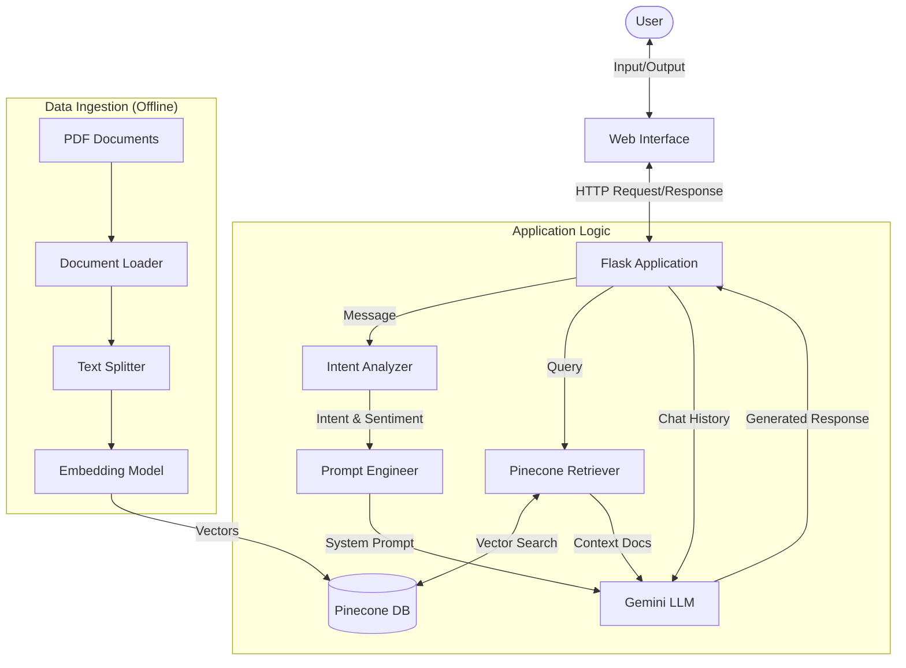
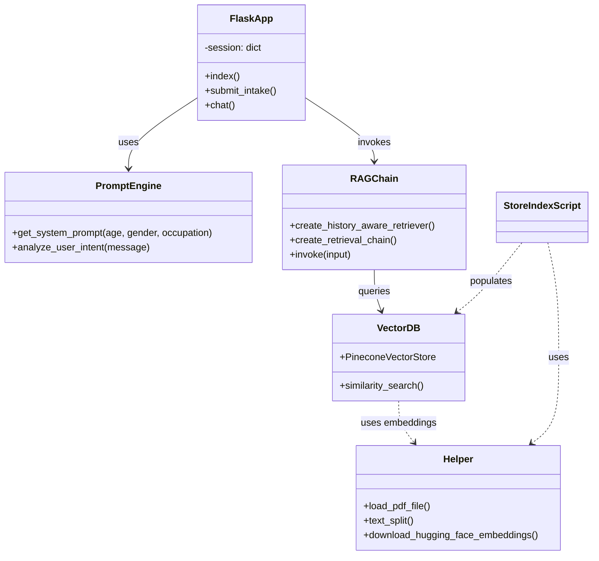
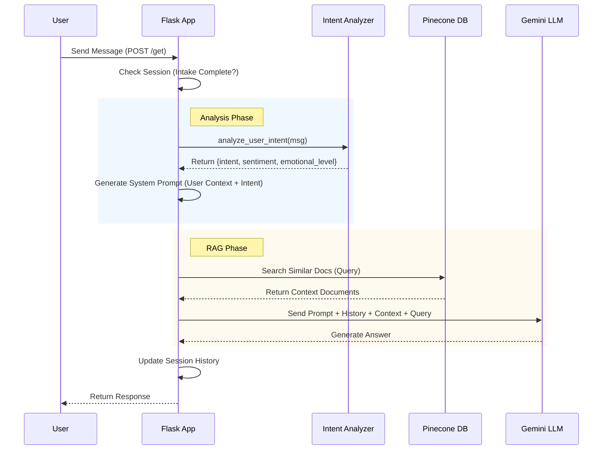

# SoulCare Chatbot - Project Documentation

## 1. Introduction
**SoulCare** is an intelligent, empathetic mental health chatbot designed to provide emotional support and practical guidance. It leverages **Retrieval-Augmented Generation (RAG)** to combine the conversational capabilities of **Google Gemini** with a specialized knowledge base stored in **Pinecone**. The application is built with **Flask** and provides a context-aware experience by analyzing user sentiment and intent.

### Tech Stack
- **Backend**: Python, Flask
- **AI/LLM**: Google Gemini (via LangChain)
- **Vector Database**: Pinecone
- **Embeddings**: HuggingFace (`sentence-transformers/all-MiniLM-L6-v2`)
- **Frontend**: HTML/CSS/JS (Templates)
- **Orchestration**: LangChain

---

## 2. System Design

### 2.1 Data Flow Diagram (DFD)
This diagram illustrates how data moves through the system, from the user's input to the final response.



### 2.2 Use Case Diagram
This diagram depicts the primary interactions users and administrators have with the system.

```mermaid
usecaseDiagram
    actor User
    actor Developer as "Admin/Developer"

    package "SoulCare System" {
        usecase "Submit Intake Form" as UC1
        usecase "Chat with Bot" as UC2
        usecase "View Chat History" as UC3
        usecase "Receive Emotional Support" as UC4
        usecase "Get Practical Advice" as UC5
        usecase "Index Knowledge Base" as UC6
    }

    User --> UC1
    User --> UC2
    UC2 ..> UC3 : include
    UC2 --> UC4
    UC2 --> UC5
    
    Developer --> UC6
```

### 2.3 Class/Component Diagram
Since the project is primarily functional (Python scripts), this diagram maps the logical components and their relationships.



### 2.4 Sequence Diagram
This diagram shows the detailed sequence of operations for handling a single user message.



---

## 3. Data Dictionary

### 3.1 Session Data
Data stored in the user's browser session (Flask `session` object).

| Key | Type | Description |
| :--- | :--- | :--- |
| `user_age` | String/Int | Age of the user provided in intake. |
| `user_gender` | String | Gender of the user provided in intake. |
| `user_occupation` | String | User's occupation (optional). |
| `intake_complete` | Boolean | Flag indicating if the intake form is finished. |
| `chat_history` | List[Dict] | List of message objects: `{'role': 'user'/'assistant', 'content': '...'}`. |

### 3.2 Pinecone Index
Metadata structure for vectors stored in Pinecone.

| Field | Type | Description |
| :--- | :--- | :--- |
| `id` | String | Unique identifier for the vector chunk. |
| `values` | List[Float] | 384-dimensional vector embedding. |
| `metadata.source` | String | Filename of the source PDF. |
| `metadata.page_content` | String | The actual text content of the chunk. |

---

## 4. Implementation Details

### 4.1 Core Application (`app.py`)
- **Intake System**: Before chatting, users must provide age, gender, and occupation. This allows the bot to tailor its persona.
- **Intent Analysis**: The `analyze_user_intent` function scans for keywords to classify the user's state (e.g., 'emotional', 'technical', 'urgent', 'venting'). This dynamically adjusts the system prompt.
- **RAG Implementation**:
    1. **History-Aware Retriever**: Reformulates the latest user question to stand alone, considering chat history.
    2. **Document Chain**: Feeds the reformulated question and retrieved context to Gemini to generate the final answer.

### 4.2 Helper Functions (`src/helper.py`)
- **PDF Loading**: Uses `DirectoryLoader` and `PyPDFLoader` to ingest medical/psychological PDFs.
- **Text Splitting**: `RecursiveCharacterTextSplitter` chunks text (size=500, overlap=20) for optimal retrieval.
- **Embeddings**: Uses `sentence-transformers/all-MiniLM-L6-v2` to convert text to vectors.

### 4.3 Prompt Engineering (`src/prompt.py`)
- **Dynamic System Prompt**: The system prompt is not static. It is constructed at runtime using:
    - User Demographics (Age, Gender, Occupation)
    - Detected Intent (e.g., if "Urgent", the bot prioritizes crisis resources).
    - Response Strategy Guidelines (Validation -> Context -> Advice).

### 4.4 Data Ingestion (`store_index.py`)
- This script is run offline/initially to populate the vector database.
- It loads PDFs from the `data/` directory, splits them, creates embeddings, and upserts them to the "mental-health-chatbot" Pinecone index.

---

## 5. Conclusion & Future Enhancements

### Conclusion
The SoulCare chatbot successfully demonstrates the application of Generative AI in mental health support. By combining a curated knowledge base with an empathetic persona and dynamic intent analysis, it provides a safe and helpful space for users to seek guidance.

### Future Enhancements
1.  **Voice Interface**: Add Speech-to-Text (STT) and Text-to-Speech (TTS) for a more natural conversation.
2.  **User Accounts**: Implement persistent database storage (SQL/NoSQL) to save user history across sessions.
3.  **Crisis Integration**: Direct integration with emergency APIs to provide real-time local helpline numbers.
4.  **Mobile App**: Wrap the frontend in React Native or Flutter for mobile deployment.
5.  **Sentiment Tracking**: Visualize user mood trends over time based on chat analysis.
