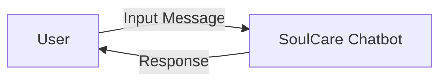
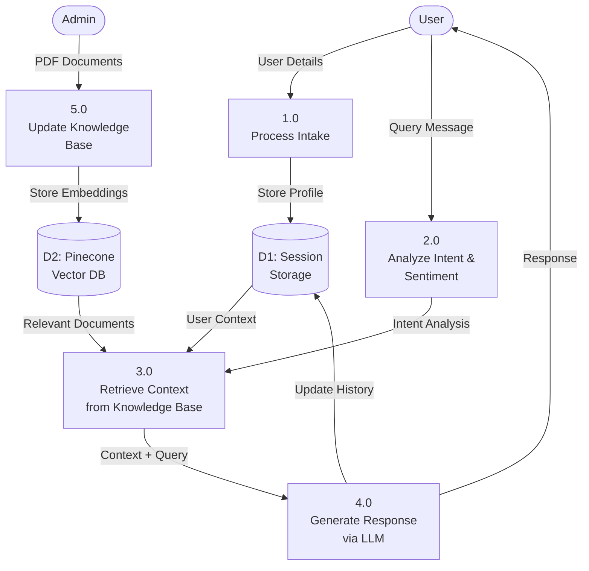
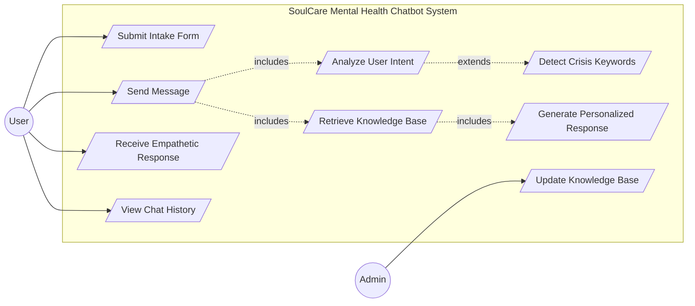
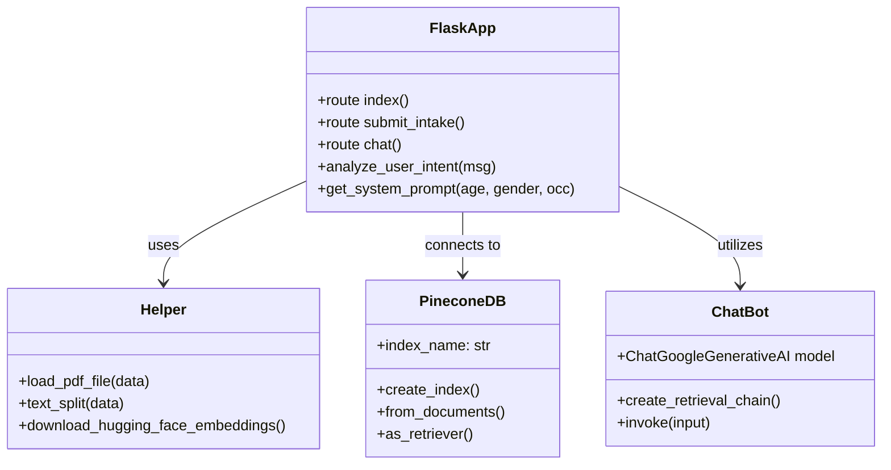
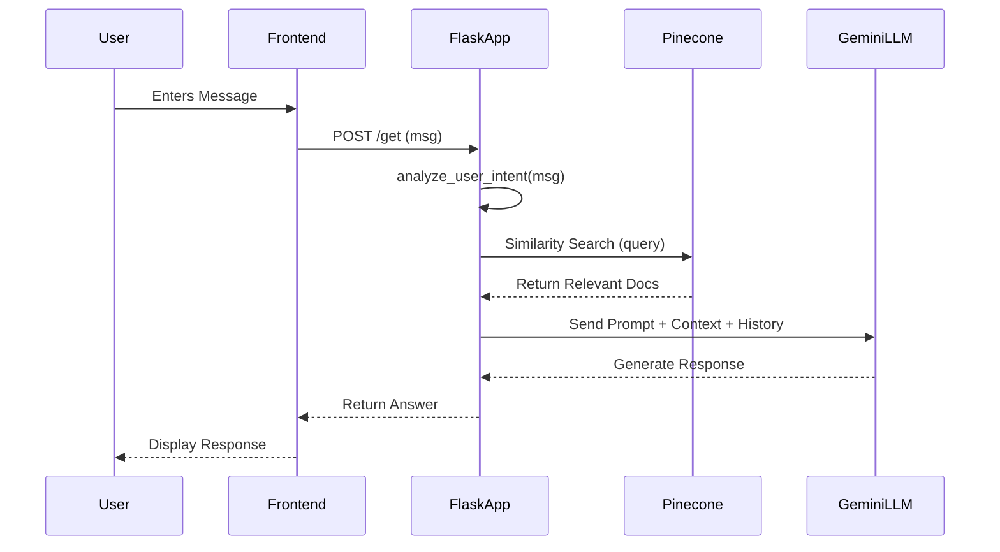

# PROJECT REPORT: Mental Health Chatbot (SoulCare)

## Acknowledgment
I take this opportunity to express my profound gratitude and deep regard to my guide, **Prof. Zalak Thakker**, for her exemplary guidance, monitoring, and constant encouragement throughout the course of this project. Her valuable insights and constructive criticism were instrumental in shaping the "SoulCare" chatbot. The blessing, help, and guidance given by her from time to time shall carry me a long way in the journey of life on which I am about to embark.

I also wish to express my sincere thanks to my teammates, **Dishan Jain** and **Stavan Shah**, for their unwavering cooperation, hard work, and shared dedication. Their technical contributions and problem-solving skills were invaluable in overcoming the various challenges we faced during the development of this system. This project is a result of our collective effort.

Lastly, I thank my parents and friends for their moral support, patience, and for keeping me motivated during the development of this project.

**Shubham Vasoya**

## Abstract
Mental health and emotional wellbeing are vital aspects of life, yet many individuals face barriers in accessing timely professional support due to stigma, cost, or availability. Traditional self-help tools often provide generic advice, which fails to adapt to individual needs. To address this gap, the project proposes "SoulCare," an AI-powered mental wellbeing chatbot designed to provide empathetic, safe, and supportive responses. By relying on Retrieval-Augmented Generation (RAG), the chatbot combines the conversational power of large language models with curated wellbeing resources. This ensures that users receive personalized, evidence-based guidance on topics such as stress management, mindfulness, sleep hygiene, and coping strategies, while also encouraging them to seek professional help when necessary.

The development process begins by constructing a knowledge base from a Mental Health and Wellbeing Encyclopedia. Large documents are ingested using PyPDFLoader and split into smaller, context-preserving chunks with RecursiveCharacterTextSplitter. These chunks are transformed into embeddings using HuggingFace's Sentence Transformers and stored in Pinecone, a vector database that enables efficient retrieval. When a user submits a query, the retriever selects the most relevant passages, which are then combined with the user’s input and processed by the LLM, specifically Google's Gemini Pro, to generate safe, empathetic responses. This pipeline ensures that the chatbot provides accurate, emotionally aware answers grounded in trusted sources rather than relying solely on the generative model.

The application is implemented using Flask for backend integration of the RAG pipeline and a web-based chat interface, allowing users to interact with the system directly through their browser. LangChain serves as the orchestration framework, connecting retrieval, embeddings, and LLM generation. Pinecone functions as the vector store, ensuring fast and scalable similarity search. The system also incorporates a user intake module to personalize interactions based on demographics like age and occupation. Together, this technology stack creates a scalable, secure, and empathetic chatbot capable of supporting users in managing their emotional well-being.

## Index
1. [About the System](#1-about-the-system)
2. [System Design Using UML](#2-system-design-using-uml)
3. [Data Dictionary](#3-data-dictionary)
4. [Implementation](#4-implementation)
5. [Conclusion](#5-conclusion)
6. [References](#6-references)

---

## 1. ABOUT THE SYSTEM

### 1.1 Problem Definition (Identification of Needs)
In the modern world, mental health issues are becoming increasingly prevalent, yet accessing timely and professional support remains a significant challenge. Many individuals face barriers such as high costs, social stigma, long waiting times, and a lack of available professionals in their vicinity.
The lack of immediate, accessible support often leaves individuals struggling with stress, anxiety, and loneliness without a safe outlet for their feelings. Traditional self-help tools often provide generic advice that fails to adapt to the user's specific emotional state or context.
The **SoulCare – Mental Health Chatbot** project addresses this challenge by leveraging Artificial Intelligence (AI) and Natural Language Processing (NLP) to provide an empathetic, intelligent, and accessible mental wellbeing assistant. The system eliminates the barrier to entry for support by offering a safe, judgment-free space where users can express themselves and receive personalized, evidence-based guidance.
The problem can be summarized as:
*"How can we democratize access to mental health support using AI to provide immediate, empathetic, and context-aware guidance while ensuring user privacy and safety?"*

### 1.2 Requirement Specifications (Product/System Tasks)
SoulCare is a web-based application designed to provide intelligent mental health support. The system performs the following key tasks:
1.  **User Intake and Profiling**
    -   Users provide basic demographic details (age, gender, occupation) to initialize the session.
    -   The system uses this data to tailor its persona and advice (e.g., student vs. professional).
2.  **Intent and Sentiment Analysis**
    -   The system analyzes every user message to detect the underlying intent (e.g., emotional distress, seeking advice, venting, emergency).
    -   It assesses sentiment and emotional intensity to adjust the tone of the response.
3.  **Contextual Knowledge Retrieval (RAG)**
    -   A Retrieval-Augmented Generation (RAG) pipeline searches a curated knowledge base of mental health resources (PDFs) stored in a vector database.
    -   Relevant information is retrieved to ground the AI's responses in psychological best practices.
4.  **Empathetic Response Generation**
    -   A pretrained Large Language Model (Google Gemini) generates responses that combine the retrieved knowledge with the user's context.
    -   The output is designed to be warm, validating, and actionable.
5.  **Emergency Detection**
    -   The system actively monitors for crisis keywords (e.g., self-harm).
    -   If detected, it prioritizes safety by providing immediate resources and suggesting professional help.

### 1.3 Tools and Technologies Used
| Category | Technology / Tool | Purpose |
| :--- | :--- | :--- |
| **Frontend** | HTML, CSS, JavaScript | Web-based user interface for the chat experience |
| **Backend** | Flask (Python) | High-performance web framework for handling requests and routing |
| **Orchestration** | LangChain | Framework for building the RAG pipeline and managing LLM chains |
| **AI Model** | Google Gemini Pro | Large Language Model for natural language understanding and generation |
| **Vector DB** | Pinecone | Storing and retrieving vector embeddings of the knowledge base |
| **Embeddings** | HuggingFace | Converting text into vector representations (`all-MiniLM-L6-v2`) |
| **Language** | Python | Core programming language for both backend logic and data processing |
| **Storage** | Session Storage | Temporary storage for user chat history and profile data |

---

## 2. SYSTEM DESIGN USING UML

The system design phase defines how the **SoulCare – Mental Health Chatbot** functions internally, including its data flow, user interactions, and architecture. UML diagrams are used to represent the structure and behavior of the system visually.
This chapter outlines the Data Flow Diagrams (DFD), Use Case Diagram, Class Diagram, and Sequence Diagram for the proposed system.

### 2.1 Data Flow Diagrams (DFD)
The Data Flow Diagrams illustrate how data moves through the SoulCare system — from user inputs to processed empathetic responses. DFDs help visualize how the system components interact and exchange information.

**(a) Level 0 DFD – Context Diagram**
The Level 0 DFD provides a high-level overview of the system showing the interaction between the User and the SoulCare System.
*   The User submits an intake form and sends chat messages.
*   The System analyzes the intent and sentiment.
*   The System retrieves relevant context from the knowledge base.
*   The System generates and returns an empathetic response to the User.



**(b) Level 1 DFD – Detailed Data Flow**
The Level 1 DFD expands on the internal processes of the system, showing key modules:
1.  **Intake Processing Module** – Handles user demographic data collection.
2.  **Intent Analysis Module** – Analyzes user messages for emotional state and urgency.
3.  **Knowledge Retrieval Module** – Searches the Pinecone vector database for relevant mental health resources.
4.  **Response Generation Module** – Uses the Gemini LLM to generate context-aware answers.
5.  **Knowledge Base Management** – Allows administrators to update the system with new PDF documents.



### 2.2 Use Case Diagram
The Use Case Diagram represents the functional interactions between the User and the SoulCare System. It helps identify what functionalities are available to users and how they are triggered.

**Actors:**
*   **User** – Submits intake details, chats with the bot, and receives support.
*   **Admin** – Updates the knowledge base with new resources.

**Use Cases:**
*   **Submit Intake Form** – User provides age, gender, and occupation.
*   **Chat with Bot** – User sends messages to the system.
*   **Analyze User Intent** – System determines if the user is venting, seeking advice, or in crisis.
*   **Retrieve Knowledge Base** – System fetches relevant documents.
*   **Detect Crisis Keywords** – System identifies emergency situations.
*   **Update Knowledge Base** – Admin adds new content to the vector store.



### 2.3 Class Diagram
The Class Diagram describes the static structure of the system, showing classes, attributes, and methods, along with their relationships.

**Main Classes:**
1.  **FlaskApp**
    *   **Attributes**: `session` (stores user context and history).
    *   **Methods**: `index()`, `submit_intake()`, `chat()`.
2.  **Helper**
    *   **Methods**: `load_pdf_file()`, `text_split()`, `download_hugging_face_embeddings()`.
3.  **PineconeDB**
    *   **Attributes**: `index_name`.
    *   **Methods**: `create_index()`, `similarity_search()`.
4.  **ChatBot (RAG Chain)**
    *   **Attributes**: `chatModel` (Gemini).
    *   **Methods**: `analyze_user_intent()`, `get_system_prompt()`, `invoke()`.

**Relationships:**
*   **FlaskApp** → uses → **Helper**
*   **FlaskApp** → connects to → **PineconeDB**
*   **FlaskApp** → utilizes → **ChatBot**



### 2.4 Sequence Diagram
The Sequence Diagram illustrates the order of interactions between system components during the chat process. It shows how the user’s message travels through the system and returns a response.

**Process Flow:**
1.  The **User** enters a message via the frontend interface.
2.  **FlaskApp** receives the message and checks the session state.
3.  The system calls `analyze_user_intent()` to determine the user's emotional state.
4.  The system queries **Pinecone** to find relevant mental health documents.
5.  **Pinecone** returns the most similar text chunks.
6.  The system constructs a prompt with the user's context, intent, and retrieved documents.
7.  **Gemini LLM** generates a personalized, empathetic response.
8.  The response is displayed to the **User**.



---

## 3. DATA DICTIONARY

This chapter provides the Data Dictionary of the SoulCare system. It includes important data items, their types, description, and usage within the system. The data elements are used during user intake, intent analysis, RAG retrieval, and response generation.

### 3.1 Data Dictionary Table
| Field Name | Data Type | Description |
| :--- | :--- | :--- |
| `user_age` | Integer | Age of the user provided during intake |
| `user_gender` | String | Gender of the user (Male/Female/Other) |
| `user_occupation` | String | User's current profession or status |
| `intake_complete` | Boolean | Flag indicating if intake form is submitted |
| `chat_history` | List | List of previous user and assistant messages |
| `user_message` | String | The current input message from the user |
| `intent` | String | Detected intent (e.g., emotional, technical, emergency) |
| `sentiment` | String | Detected sentiment (positive, negative, neutral, urgent) |
| `system_prompt` | String | Dynamically generated instruction for the LLM |
| `pinecone_id` | String | Unique identifier for a vector in the database |
| `embedding_vector` | List[Float] | 384-dimensional vector representation of text |
| `context_docs` | String | Retrieved text chunks from the knowledge base |
| `response_text` | String | Final empathetic response generated by the LLM |

### 3.2 Description of Data Elements
*   **user_age**: Stores the age of the user to tailor advice appropriateness.
*   **user_gender**: Used to personalize pronouns and specific health advice.
*   **user_occupation**: Helps contextually frame advice (e.g., work stress vs. study stress).
*   **intake_complete**: Session flag to ensure users don't bypass the intake process.
*   **chat_history**: Maintains the context of the conversation for multi-turn dialogue.
*   **user_message**: The raw text input provided by the user in the chat interface.
*   **intent**: The classification of the user's need, driving the response strategy.
*   **sentiment**: The emotional tone of the message, used to adjust empathy levels.
*   **system_prompt**: The master instruction sent to Gemini, combining persona and context.
*   **pinecone_id**: Unique ID for each document chunk stored in the vector DB.
*   **embedding_vector**: Numerical representation of text used for similarity searching.
*   **context_docs**: The actual content from PDFs retrieved to answer the user's query.
*   **response_text**: The final output displayed to the user.

### 3.3 Flow of Data Usage
1.  User submits Intake Form → `user_age`, `user_gender`, `user_occupation` stored in session.
2.  User sends a message → `user_message` captured.
3.  System analyzes message → `intent` and `sentiment` derived.
4.  System generates embedding → `embedding_vector` created.
5.  Vector search in Pinecone → `pinecone_id` and `context_docs` retrieved.
6.  Prompt construction → `system_prompt` built using user profile and intent.
7.  LLM generation → `chat_history` and `context_docs` fed to model.
8.  Response generation → `response_text` created and displayed to user.

---

## 4. IMPLEMENTATION

This chapter describes how the SoulCare system is implemented using Flask, LangChain, Pinecone, and Google Gemini. The implementation consists of multiple modules that work together to process user intake, analyze intent, retrieve knowledge, and generate empathetic responses.

## 4. IMPLEMENTATION

### 4.1 Screen Layouts with Validations
The implementation creates a seamless user experience using a responsive web interface.

**1. The Intake Modal (Input Layer)**
The intake screen acts as the initial configuration panel. It uses HTML forms with JavaScript validation to prevent invalid entries.
*   **Validation**: Age is validated to be a realistic number. Gender is a required dropdown selection.
*   **Session Management**: The inputs are stored in the Flask `session` object to persist user context across the conversation.

*   **Fig 4.1: User Intake Form**
    *(Screenshot of the modal asking for Age/Gender)*

**2. The Chat Interface (Output Layer)**
The main area displays the ongoing conversation with the SoulCare bot.
*   **Visuals**: Messages are styled with distinct "User" (Right) and "SoulCare" (Left) bubbles.
*   **Feedback**: A typing indicator is shown while the RAG pipeline retrieves and generates the response.

*   **Fig 4.2: Chat Interface (Welcome)**
    *(Screenshot of the initial greeting)*

*   **Fig 4.3: Empathetic Response Example**
    *(Screenshot showing the bot responding to an emotional query)*

*   **Fig 4.4: Crisis Intervention**
    *(Screenshot showing the bot providing helpline numbers)*

### 4.2 Sample Coding
The following source code represents the core logic of the system.

**A. User Intake & Session (`app.py`)**
This route handles the initial data collection. It mirrors the "structured data" requirement by validating inputs before starting the chat session.
```python
@app.route("/submit-intake", methods=["POST"])
def submit_intake():
    """Handle user intake form submission with validation"""
    data = request.get_json()
    age = data.get("age")
    gender = data.get("gender")
    occupation = data.get("occupation", "")

    if not age or not gender:
        return jsonify({"success": False, "message": "Age and gender are required"}), 400

    session['user_age'] = age
    session['user_gender'] = gender
    session['user_occupation'] = occupation
    session['chat_history'] = [] 
    
    return jsonify({"success": True})
```

**B. The AI Controller (`app.py`)**
This function manages the interaction with the Google Gemini API. It constructs the dynamic system prompt and coordinates the Retrieval-Augmented Generation (RAG) chain.
```python
def chat():
    # ... (Session retrieval omitted for brevity) ...
    
    # 1. Intent Analysis to steer the persona
    analysis = analyze_user_intent(msg)
    
    # 2. Dynamic System Prompt Construction
    system_prompt_text = get_system_prompt(age, gender, occupation)
    intent_context = (
        f"User Intent: {analysis['intent'].upper()} | "
        f"Sentiment: {analysis['sentiment']} | "
        f"Emotional Level: {analysis['emotional_level']}"
    )
    
    # 3. RAG Chain Execution
    full_system_prompt = f"{system_prompt_text}\n\n{intent_context}\n\nContext: {{context}}"
    
    qa_prompt = ChatPromptTemplate.from_messages([
        ("system", full_system_prompt),
        MessagesPlaceholder("chat_history"),
        ("human", "{input}"),
    ])
    
    # ... (LangChain instantiation) ...
    response = rag_chain.invoke({"input": msg, "chat_history": chat_history})
    return str(response['answer'])
```

**C. Knowledge Ingestion (`store_index.py`)**
This module converts raw PDF documents into vector embeddings for the Pinecone database, enabling the semantic search capability.
```python
# Load PDF Data
def load_pdf_file(data):
    loader = DirectoryLoader(data, glob="*.pdf", loader_cls=PyPDFLoader)
    documents = loader.load()
    return documents

# Split and Embed
text_chunks = text_split(extracted_data)
embeddings = download_hugging_face_embeddings()

# Store in Pinecone
docsearch = PineconeVectorStore.from_documents(
    documents=text_chunks,
    index_name=index_name,
    embedding=embeddings
)
```

### 4.3 Steps of the Execution (Project Navigation)
To execute the project locally, the following steps were followed:

**Step 1: Environment Setup**
A virtual environment was created to isolate dependencies.
```bash
python -m venv venv
source venv/bin/activate # On Windows: venv\Scripts\activate
```

**Step 2: Dependency Installation**
Libraries listed in `requirements.txt` were installed.
```bash
pip install -r requirements.txt
```
~ Key libraries installed: `flask`, `langchain`, `pinecone-client`, `google-generativeai`, `sentence-transformers`.

**Step 3: Configuration**
A `.env` file was created in the root directory to securely store the API Keys.
```ini
PINECONE_API_KEY=pcsk_...
GEMINI_API_KEY=AIzaSy...
```

**Step 4: Launching the Application**
The Flask server was started.
```bash
python app.py
```

**Step 5: User Navigation**
*   **Profile Entry**: The user opens `localhost:8080`, fills in Age, Gender, and Occupation in the modal.
*   **Chatting**: The user types a message (e.g., "I feel stressed").
*   **Response**: The system retrieves relevant context and generates an empathetic reply based on the user's profile.


---

## 5. CONCLUSION

### 5.1 Summary of Achievements
The **SoulCare – Mental Health Chatbot** project successfully bridges the gap between advanced Artificial Intelligence and accessible mental healthcare. By leveraging the **Google Gemini Pro** model, we have moved beyond the traditional "rule-based" architecture used by most early chatbots. Instead of retrieving pre-stored static responses, this system functions as a context-aware empathetic engine, capable of synthesizing unique, supportive responses in real-time based on the user's specific emotional state.

The project achieved all its primary objectives:
*   **End-to-End Implementation:** Successfully developed a full-stack application using **Flask** for the backend and a responsive HTML/JS interface for the frontend.
*   **Grounded AI Output:** Overcame the common challenge of "LLM Hallucinations" by implementing a **Retrieval-Augmented Generation (RAG)** pipeline. This ensured that the AI's advice was grounded in verified psychological resources stored in **Pinecone**, rather than generating purely creative text.
*   **Dynamic Persona Adaptation:** Implemented a sophisticated **Intent Analysis** system that dynamically adjusts the chatbot's tone (e.g., from "Empathetic Listener" to "Crisis Interventionist") based on the urgency and sentiment of the user's input.

### 5.2 Importance of the Work
The significance of this work can be analyzed from both a Societal and a Technical perspective.

#### 5.2.1 Societal Impact: Democratizing Mental Support
In many parts of the world, access to quality mental health support is a privilege restricted by high costs and social stigma. Clinical therapy is often expensive, and public resources are scarce. This system effectively "democratizes" emotional support. By functioning as a 24/7 first line of defense, SoulCare empowers individuals to seek help without fear of judgment, respecting their:
*   **Privacy:** Providing a safe, anonymous space to vent and process emotions.
*   **Accessibility:** Immediate support available at any time, bridging the gap between improved mental awareness and professional appointment availability.
*   **Financial Constraints:** Offering free, evidence-based coping strategies and guidance without the cost of a therapy session.

#### 5.2.2 Technical Significance: The Shift to Semantic Search
From a computer engineering perspective, this project demonstrates a shift from "keyword matching" to "semantic understanding." Traditional search looks for exact words. This project utilizes **Vector Embeddings** and **Semantic Search**. We successfully demonstrated that:
1.  **Context is Key:** The logic for "how to respond" is not hardcoded but derived from a fusion of **User Profile** (Age/Gender), **Conversation History**, and **Retrieved Knowledge**.
2.  **Stateless Scalability:** The application logic is lightweight, leveraging the heavy lifting of the **Vector Database (Pinecone)** and the **LLM API**, allowing the system to scale easily without a massive local infrastructure.

### 5.3 Challenges and Limitations
While the system is functional, the development process highlighted several challenges that serve as learning opportunities:
*   **Response Latency:** The RAG process involves embedding the query, searching the vector DB, and generating the LLM response. This chain of operations can sometimes take 3-5 seconds, which, while acceptable, is slower than instant rule-based bots.
*   **Context Window Limits:** The current session-based memory allows for short-term context. However, for very long conversations, earlier details might drop out of the model's context window, requiring summarization techniques in future builds.
*   ** nuance Detection:** While the sentiment analysis is robust, detecting subtle sarcasm or highly complex mixed emotions remains a challenge for current NLP models compared to a human therapist.

### 5.4 Future Enhancements
To evolve this project from an academic prototype to a commercial-grade product, the following enhancements are proposed:

1.  **Multimodal Emotion Recognition**
    Future versions could integrate **Computer Vision** or **Audio Analysis**. This would allow the system to:
    *   **"See" the User:** Analyze facial expressions via webcam to detect sadness or distress.
    *   **"Hear" the Tone:** Analyze voice modulation to detect anxiety or panic, adjusting the response strategy not just on *what* is said, but *how* it is said.

2.  **User Accounts & Long-Term Memory**
    Implementing a persistent database (PostgreSQL/MongoDB) to store user history would enable **Long-Term Memory**. If a user mentioned a specific stressor (e.g., "final exams") last week, the bot should be able to ask, "How did your exams go?" today, transforming it from a "Chatbot" to a true "AI Companion."

3.  **Professional Handoff Integration**
    Currently, the system suggests help. Future iterations could integrate with **Telehealth APIs**. If the "Crisis Keyword" threshold is breached, the system could offer to instantly connect the user to a human counselor or a suicide prevention hotline with a single click.

4.  **Sentiment Tracking Dashboard**
    A visual dashboard for users to track their emotional journey. By aggregating sentiment scores over weeks, the system could generate reports like "You seem to feel most anxious on Sunday evenings," helping users identify triggers and patterns in their mental health.

---

## 6. REFERENCES

This chapter enumerates the foundational literature, technical documentation, and critical software libraries that underpinned the design, development, and validation of the SoulCare – Mental Health Chatbot. The architecture relies heavily on modern principles of generative AI, semantic search, and psychological best practices.

### 6.1 Generative AI, Methodology, and Academic Sources
The core reasoning capability of this project is derived from advancements in Large Language Models (LLMs) and Retrieval-Augmented Generation (RAG) methodologies.

1.  **Google Generative AI Documentation.** This documentation served as the primary technical resource for interacting with the **Google Gemini Pro** model. It was essential for understanding API configurations, safety settings, and the prompt engineering strategies required to ensure empathetic and non-harmful responses.
    *   (Reference example: Google AI Developers. (n.d.). *Gemini API Documentation*. Retrieved from https://ai.google.dev/docs)

2.  **Retrieval-Augmented Generation (RAG) Literature.** The intelligent behavior of SoulCare is enabled by RAG, a method that retrieves relevant knowledge from verified sources before generating an answer. This methodology was crucial for grounding the AI's advice in medical reality rather than hallucinated text.
    *   (Reference example: Lewis, P., et al. (2020). *Retrieval-Augmented Generation for Knowledge-Intensive NLP Tasks*. NeurIPS.)

3.  **Research on AI in Mental Health.** Sources discussing the efficacy and ethical considerations of chatbots in therapy were critical. This validated the choice of using a "supportive listener" persona rather than attempting to diagnose conditions.
    *   (Reference example: Abd-Alrazaq, A.A., et al. (2020). *The Effectiveness of Artificial Intelligence-Based Chatbots for Mental Health Assistance: A Systematic Review*. Journal of Medical Internet Research, 22(7), e17165.)

### 6.2 Software Libraries and Framework Documentation
The successful implementation of the RAG pipeline and web interface relied entirely on powerful Python libraries.

1.  **LangChain Documentation.** This was the foundational resource for orchestrating the AI components. It guided the creation of the **Retriever**, the integration with the Vector Database, and the construction of the prompt chains that combine user history with retrieved context.
    *   (Reference example: LangChain AI. (n.d.). *LangChain Python Documentation*. Retrieved from https://python.langchain.com)

2.  **Pinecone Documentation.** This documentation provided the guidelines for storing and querying high-dimensional vector embeddings. It was essential for implementing the semantic search capability that allows the chatbot to find relevant advice based on meaning rather than just keywords.
    *   (Reference example: Pinecone Systems. (n.d.). *Pinecone Knowledge Base*. Retrieved from https://docs.pinecone.io)

3.  **Flask Documentation.** Used for building the backend application server. It provided the structure for handling HTTP requests, managing user sessions (for chat history), and serving the frontend interface.
    *   (Reference example: Pallets Projects. (n.d.). *Flask Documentation*. Retrieved from https://flask.palletsprojects.com)

4.  **HuggingFace `sentence-transformers`.** The documentation for the `all-MiniLM-L6-v2` model was used to understand how to convert textual medical data into numerical vectors for efficient machine retrieval.
    *   (Reference example: Hugging Face. (n.d.). *Sentence Transformers Documentation*. Retrieved from https://huggingface.co/docs)

### 6.3 Mental Health and Psychological Guidelines
The AI’s knowledge base, while accessed via semantic search, is ultimately grounded in recognized psychological standards.

1.  **World Health Organization (WHO) Mental Health Resources.** To ensure the chatbot provides universally accepted advice for stress and anxiety, the knowledge base includes principles derived from WHO guidelines.
    *   (Reference example: World Health Organization. (n.d.). *Mental Health and Substance Use*. Retrieved from https://www.who.int/health-topics/mental-health)

2.  **Crisis Intervention Protocols.** The logic for identifying "emergency" keywords and providing helpline numbers is based on standard suicide prevention and crisis intervention protocols.
    *   (Reference example: *National Suicide Prevention Lifeline Best Practices*.)
