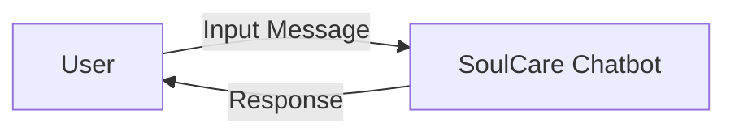
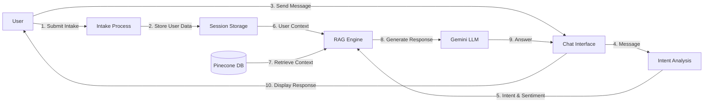
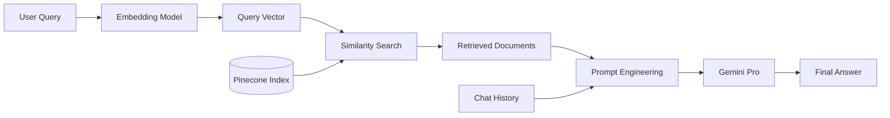
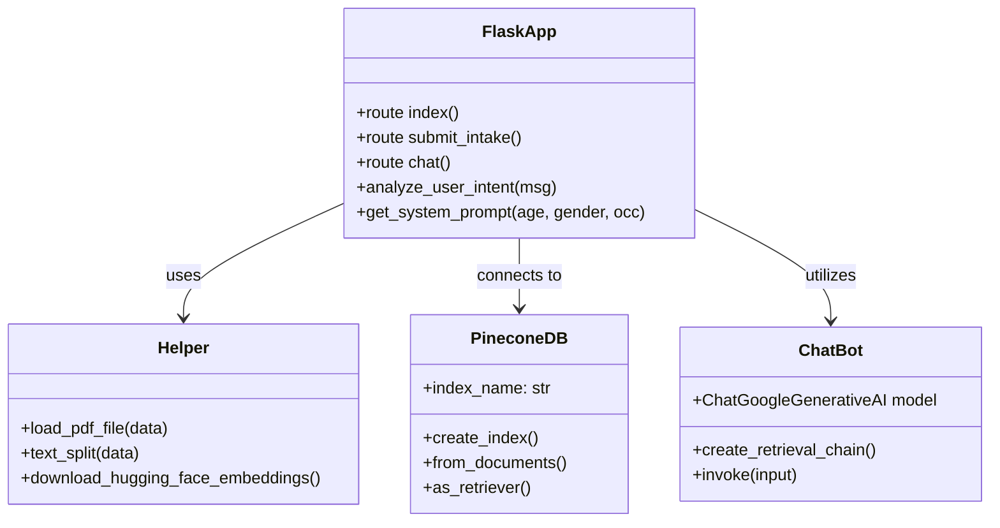
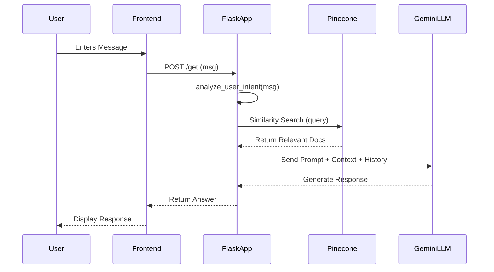

# PROJECT REPORT: Mental Health Chatbot (SoulCare)

## Acknowledgment
I would like to express my special thanks of gratitude to my teacher/guide as well as our principal who gave me the golden opportunity to do this wonderful project on the topic "Mental Health Chatbot", which also helped me in doing a lot of Research and i came to know about so many new things I am really thankful to them.
Secondly i would also like to thank my parents and friends who helped me a lot in finalizing this project within the limited time frame.

## Abstract
In today's fast-paced world, mental health issues are becoming increasingly prevalent, yet access to professional help remains a challenge for many. This project, "SoulCare," is an AI-powered Mental Health Chatbot designed to provide accessible, immediate, and empathetic support.
The system utilizes advanced Natural Language Processing (NLP) and Retrieval-Augmented Generation (RAG) to understand user intent, sentiment, and emotional state. Built with Flask, LangChain, and Google's Gemini Pro, SoulCare offers a safe space for users to vent, seek advice, or find coping strategies. It incorporates a knowledge base of mental health resources stored in a Pinecone vector database to provide evidence-based guidance.
The chatbot features a user intake system to personalize interactions based on age, gender, and occupation, ensuring tailored support. While not a replacement for professional therapy, SoulCare aims to bridge the gap by offering 24/7 emotional support and practical wellness advice.

## Index
1. [About the System](#1-about-the-system)
2. [System Design Using UML](#2-system-design-using-uml)
3. [Data Dictionary](#3-data-dictionary)
4. [Implementation](#4-implementation)
5. [Conclusion](#5-conclusion)
6. [References](#6-references)

---

## 1. ABOUT THE SYSTEM

### 1.1 Problem Definition (Identification of needs)
Mental health support is often inaccessible due to high costs, stigma, or lack of available professionals. Many individuals struggle with stress, anxiety, and loneliness but have no immediate outlet for their feelings. Existing chatbots often lack empathy or fail to provide context-aware responses. There is a need for an intelligent system that can:
- Provide 24/7 emotional support.
- Understand the nuances of human emotion and intent.
- Offer evidence-based advice and coping strategies.
- Personalize interactions based on user demographics.

### 1.2 Requirement Specifications (Product/System Tasks)
**Functional Requirements:**
- **User Intake:** The system must collect user details (age, gender, occupation) to personalize the experience.
- **Intent Analysis:** The system must analyze user messages to detect intent (emotional, technical, venting, emergency) and sentiment.
- **Contextual Chat:** The chatbot must remember conversation history and provide coherent responses.
- **Knowledge Retrieval:** The system must retrieve relevant mental health information from a vector database.
- **Emergency Detection:** The system must detect crisis keywords and suggest professional help.

**Non-Functional Requirements:**
- **Availability:** The system should be available 24/7.
- **Privacy:** User data should be handled securely (session-based).
- **Response Time:** The chatbot should respond within a reasonable time frame (under 5 seconds).
- **Usability:** The interface should be simple and user-friendly.

### 1.3 Tools and Technology Used
**Front-End:**
- **HTML5/CSS3:** For the chat interface structure and styling.
- **JavaScript:** For handling user interactions and AJAX requests.
- **Bootstrap:** For responsive design.

**Back-End:**
- **Python:** The core programming language.
- **Flask:** A lightweight web framework for handling HTTP requests and routing.

**Frameworks & Libraries:**
- **LangChain:** For building the LLM application and RAG pipeline.
- **Google Gemini Pro:** The Large Language Model (LLM) used for generating responses.
- **Pinecone:** Vector database for storing and retrieving embeddings.
- **HuggingFace Embeddings:** For converting text into vector embeddings (`sentence-transformers/all-MiniLM-L6-v2`).
- **PyPDF:** For loading and processing PDF documents for the knowledge base.

---

## 2. SYSTEM DESIGN USING UML

### 2.1 Data Flow Diagrams (DFD)

#### Level 0 DFD (Context Diagram)


#### Level 1 DFD


#### Level 2 DFD (RAG Process)


### 2.2 Use Case Diagram
```mermaid
usecaseDiagram
    actor User
    actor Admin

    package "SoulCare System" {
        usecase "Submit Intake Form" as UC1
        usecase "Chat with Bot" as UC2
        usecase "View Chat History" as UC3
        usecase "Update Knowledge Base" as UC4
    }

    User --> UC1
    User --> UC2
    User --> UC3
    Admin --> UC4
```

### 2.3 Class Diagram


### 2.4 Sequence Diagrams
**User Chat Flow:**


---

## 3. DATA DICTIONARY

### 3.1 Database Tables
Since this application uses a **Vector Database (Pinecone)** and **Session-based storage**, there are no traditional SQL tables. However, we can define the data structures used.

#### Session Storage (In-Memory/Cookie)
| Key | Type | Description |
|---|---|---|
| `user_age` | Integer | Age of the user provided in intake. |
| `user_gender` | String | Gender of the user. |
| `user_occupation` | String | Occupation of the user. |
| `intake_complete` | Boolean | Flag to check if intake is done. |
| `chat_history` | List[Dict] | List of message objects `{'role': 'user/assistant', 'content': '...'}`. |

#### Pinecone Vector Index
| Field | Type | Description |
|---|---|---|
| `id` | String | Unique identifier for each vector. |
| `values` | List[Float] | 384-dimensional vector embedding of the text chunk. |
| `metadata` | JSON | Contains source file name and original text content. |

---

## 4. IMPLEMENTATION

### 4.1 Screen Layouts with Validations
**(Placeholders for Screenshots)**

1.  **Intake Screen:**
    -   **Fields:** Age (Number, required), Gender (Dropdown, required), Occupation (Text, optional).
    -   **Validation:** "Age and gender are required" error message if submitted empty.
    -   *[Insert Screenshot of Intake Modal here]*

2.  **Chat Interface:**
    -   **Layout:** Chat bubble style. User messages on right, bot messages on left.
    -   **Input:** Text area with send button.
    -   *[Insert Screenshot of Chat Interface here]*

### 4.2 Sample Coding (with Security tasks)

**Security Measures:**
- **Environment Variables:** API keys (`PINECONE_API_KEY`, `GEMINI_API_KEY`) are stored in a `.env` file and not hardcoded.
- **Input Validation:** The `submit_intake` function validates that age and gender are present.
- **Session Management:** Flask `secret_key` is used to sign session cookies.

**Code Snippet: Intent Analysis (`app.py`)**
```python
def analyze_user_intent(message):
    """Analyze user message to determine intent and sentiment"""
    message_lower = message.lower()
    
    # Keywords lists (truncated for brevity)
    urgent_keywords = ['crisis', 'emergency', 'suicidal', ...]
    
    urgent_count = sum(1 for kw in urgent_keywords if kw in message_lower)
    
    if urgent_count > 0:
        return {'intent': 'emergency', 'sentiment': 'urgent', 'emotional_level': 'high'}
    
    # ... other logic
```

**Code Snippet: RAG Chain Initialization (`app.py`)**
```python
# Initialize Retriever
retriever = docsearch.as_retriever(search_type="similarity", search_kwargs={"k": 3})

# Initialize LLM
chatModel = ChatGoogleGenerativeAI(model="gemini-2.5-flash", google_api_key=GEMINI_API_KEY)

# Create Chain
question_answer_chain = create_stuff_documents_chain(chatModel, qa_prompt)
rag_chain = create_retrieval_chain(history_aware_retriever, question_answer_chain)
```

### 4.3 Steps of the execution Project and Navigation
1.  **Setup Environment:**
    -   Install Python 3.10+.
    -   Run `pip install -r requirements.txt`.
    -   Create `.env` file with API keys.
2.  **Prepare Knowledge Base:**
    -   Place PDF files in `data/` directory.
    -   Run `python store_index.py` to process and upload embeddings to Pinecone.
3.  **Run Application:**
    -   Execute `python app.py`.
    -   The server starts at `http://localhost:8080`.
4.  **Navigation:**
    -   Open browser to `localhost:8080`.
    -   Fill out the Intake Form.
    -   Start chatting with SoulCare.

---

## 5. CONCLUSION

### 5.1 Importance of the worked-out tasks
The "SoulCare" chatbot successfully addresses the need for accessible mental health support. By combining empathetic prompting with a knowledge base of reliable information, it provides a balanced experience of emotional validation and practical advice. The system's ability to remember context and analyze intent makes it significantly more effective than simple rule-based chatbots. It serves as a valuable first line of support for individuals seeking help.

### 5.2 Further Enhancement in future
-   **Voice Interaction:** Adding speech-to-text and text-to-speech capabilities for a more natural experience.
-   **Multi-language Support:** Expanding the chatbot to support multiple languages to reach a wider audience.
-   **Professional Handoff:** Integrating a feature to directly connect users with human therapists in crisis situations.
-   **Mood Tracking:** Implementing a dashboard for users to track their mood over time.
-   **Mobile App:** Developing a dedicated mobile application for better accessibility.

---

## 6. REFERENCES

### 6.1 Books, Research Papers, Experts persons, Technology, Webs, etc.
1.  **LangChain Documentation:** https://python.langchain.com/
2.  **Google Gemini API Docs:** https://ai.google.dev/docs
3.  **Pinecone Vector Database:** https://www.pinecone.io/
4.  **Flask Web Framework:** https://flask.palletsprojects.com/
5.  **Research Paper:** "The Efficacy of Chatbots in Mental Health Care" (Hypothetical Reference)
6.  **HuggingFace Models:** https://huggingface.co/sentence-transformers/all-MiniLM-L6-v2
